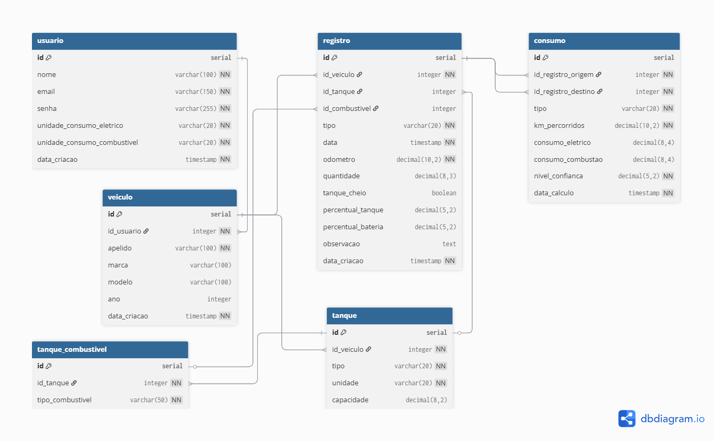

# Modelo do Banco de Dados

## Diagrama



---

## Entidades e relacionamentos

O sistema é estruturado em torno das seguintes entidades e seus relacionamentos:

```
Usuario → tem vários Veiculos
Veiculo → tem vários Tanques (um por tipo: elétrico ou líquido)
Tanque  → tem vários TanqueCombustiveis (permite veículos flex)
Tanque  → tem vários Registros
Veiculo → tem vários Registros (checkpoints são associados ao veículo, não a um tanque)
Registro → participa de vários Consumos (como origem ou destino)
```

Cada **Registro de Consumo** é calculado no momento de um novo abastecimento e associado ao abastecimento **anterior**, não ao atual. Isso corrige um erro comum em outros aplicativos do gênero, que associam o consumo calculado ao combustível recém-adicionado.

---

## Tabelas

### usuario

Armazena os dados dos usuários do sistema.

| Coluna | Tipo | Descrição |
|--------|------|-----------|
| id | serial | Chave primária |
| nome | varchar(100) | Nome do usuário |
| email | varchar(150) | E-mail único, usado para login |
| senha | varchar(255) | Senha criptografada |
| unidade_consumo_eletrico | varchar(20) | `km_kwh` ou `kwh_100km` |
| unidade_consumo_combustivel | varchar(20) | `km_l`, `l_100km` ou `mpg` |
| data_criacao | timestamp | Data de criação do registro |

---

### veiculo

Armazena os veículos de cada usuário.

| Coluna | Tipo | Descrição |
|--------|------|-----------|
| id | serial | Chave primária |
| id_usuario | integer | Referência ao usuário dono do veículo |
| apelido | varchar(100) | Nome amigável para identificação (ex: "King") |
| marca | varchar(100) | Marca do veículo |
| modelo | varchar(100) | Modelo do veículo |
| ano | integer | Ano de fabricação |
| data_criacao | timestamp | Data de criação do registro |

---

### tanque

Representa os tanques de um veículo que podem ser carregados. Veículos PHEV possuem dois tanques: um elétrico e um líquido. Veículos convencionais possuem apenas um tanque líquido. No caso de veículos Híbridos não plug-in, será considerado como veículo de um tanque.

| Coluna | Tipo | Descrição |
|--------|------|-----------|
| id | serial | Chave primária |
| id_veiculo | integer | Referência ao veículo |
| tipo | varchar(20) | `eletrico` ou `liquido` |
| unidade | varchar(20) | `kWh` para elétrico, `L` para líquido |
| capacidade | decimal(8,2) | Capacidade total do tanque |

---

### tanque_combustivel

Define os tipos de combustível compatíveis com um tanque líquido. Permite suporte a veículos flex, que aceitam mais de um tipo de combustível no mesmo tanque.

| Coluna | Tipo | Descrição |
|--------|------|-----------|
| id | serial | Chave primária |
| id_tanque | integer | Referência ao tanque |
| tipo_combustivel | varchar(50) | Ex: `gasolina`, `etanol`, `diesel` |

---

### registro

Armazena todos os eventos registrados pelo usuário: abastecimentos e checkpoints. Ambos compartilham a mesma tabela pois possuem estrutura similar.

**Abastecimentos** são associados a um tanque e informam a quantidade abastecida. **Checkpoints** são associados ao veículo como um todo, sem tanque específico, e registram o estado geral do veículo em um determinado momento.

| Coluna | Tipo | Descrição |
|--------|------|-----------|
| id | serial | Chave primária |
| id_veiculo | integer | Referência ao veículo |
| id_tanque | integer | Referência ao tanque (nulo para checkpoints) |
| id_combustivel | integer | Referência ao combustível utilizado (nulo para checkpoints e tanques elétricos) |
| tipo | varchar(20) | `abastecimento` ou `checkpoint` |
| data | timestamp | Data e hora do registro |
| odometro | decimal(10,2) | Leitura do hodômetro total no momento do registro |
| quantidade | decimal(8,3) | Quantidade abastecida em L ou kWh (nulo para checkpoints) |
| tanque_cheio | boolean | Indica se o tanque foi completamente abastecido (atalho para 100%) |
| percentual_tanque | decimal(5,2) | Percentual estimado do tanque líquido no momento do registro |
| percentual_bateria | decimal(5,2) | Percentual da bateria no momento do registro |
| observacao | text | Observação livre do usuário (ex: "Parada para descanso") |
| data_criacao | timestamp | Data de criação do registro |

---

### consumo

Armazena os cálculos de consumo entre dois registros consecutivos. Cada linha representa o consumo de um **trecho** (entre dois registros quaisquer) ou de um **tanque** completo (entre dois abastecimentos com tanque cheio).

O consumo de tanque completo pode ser calculado de duas formas: como média ponderada dos trechos intermediários, ou diretamente a partir dos dois abastecimentos completos, sendo que ambos os métodos devem convergir para o mesmo resultado.

| Coluna | Tipo | Descrição |
|--------|------|-----------|
| id | serial | Chave primária |
| id_registro_origem | integer | Registro inicial do trecho |
| id_registro_destino | integer | Registro final do trecho |
| tipo | varchar(20) | `trecho` ou `tanque` |
| km_percorridos | decimal(10,2) | Quilômetros rodados entre os dois registros |
| consumo_eletrico | decimal(8,4) | Consumo elétrico calculado (nulo se não aplicável) |
| consumo_combustao | decimal(8,4) | Consumo de combustível calculado (nulo se não aplicável) |
| nivel_confianca | decimal(5,2) | Percentual de confiança do cálculo (0 a 100) |
| data_calculo | timestamp | Data em que o cálculo foi realizado |

---

## Níveis de confiança do cálculo

Cada registro de consumo possui um nível de confiança que reflete a precisão do cálculo com base nas informações disponíveis:

- **Alta precisão:** ambos os tanques estavam cheios no abastecimento de origem e apenas um tipo de combustível foi utilizado no intervalo. O cálculo é exato.
- **Precisão média:** o usuário forneceu informações adicionais como percentual da bateria, percentual do tanque ou checkpoints intermediários.
- **Precisão estimada:** apenas dados básicos de abastecimento e hodômetro estão disponíveis. O sistema utiliza médias históricas de consumo do veículo para estimar a distribuição entre os combustíveis.